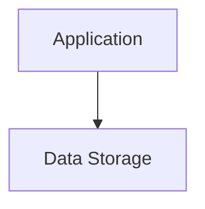

# Architecture Diagram
Last updated: 2026-01-08 07:27:34 UTC

## Overview

The architecture consists of an Application component that interacts with a Data Storage component. The Application processes user requests and performs necessary computations, while the Data Storage serves as the persistent layer where all relevant data is stored and retrieved, ensuring data integrity and availability. Data flows from the Application to the Data Storage for saving or updating information, and it flows back to the Application when data needs to be accessed or displayed.
